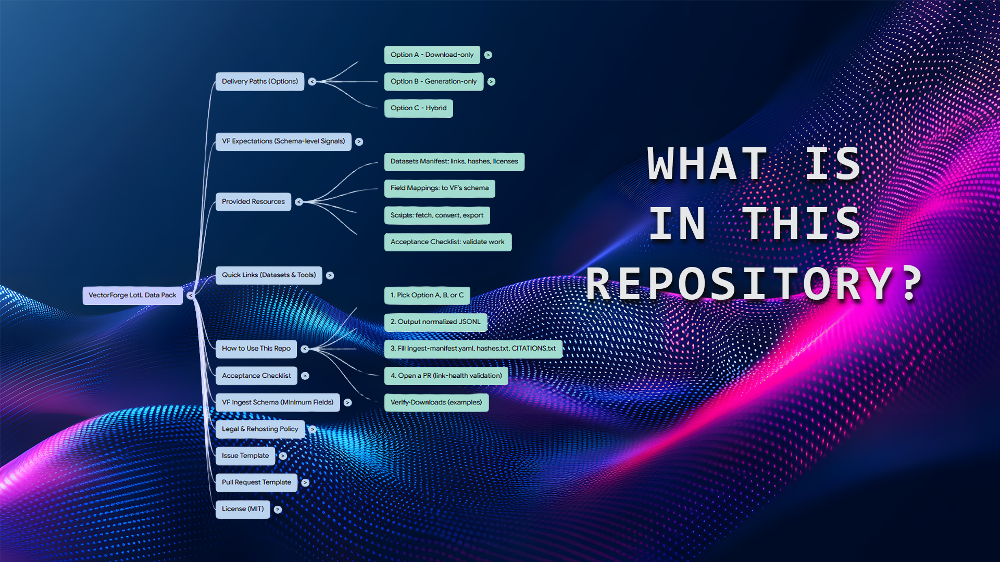

# VectorForge LotL Data Pack

[](LICENSE.md)
[](https://<org>.github.io/<repo>/)
[](https://github.com/<org>/<repo>/actions/workflows/link-check.yml)



> Three delivery paths for Living-off-the-Land (LotL) telemetry into VectorForge  
> **A:** Download • **B:** Generate • **C:** Hybrid

---

**Purpose:** give partners three proven paths to deliver **Living-off-the-Land (LotL)** telemetry into VectorForge (VF) with minimal back-and-forth.

- **Option A — Download-only:** Seed with public, LotL-relevant datasets (Windows + Sysmon).
- **Option B — Generation-only:** Generate LotL activity in your lab; export Windows/Sysmon/PowerShell/WMI/BITS.
- **Option C — Hybrid:** Seed + generate for fast coverage *and* environment realism.

---

## Quick Links (Datasets & Tools)

- **Splunk BOTS v3** — CC0 — Pre-indexed Splunk dataset  
  **Download:** https://botsdataset.s3.amazonaws.com/botsv3/botsv3_data_set.tgz  
  **Verify (MD5):** `d7ccca99a01cff070dff3c139cdc10eb` (published by Splunk)  
  **Notes:** Includes `wineventlog` and `xmlwineventlog:microsoft-windows-sysmon/operational` sourcetypes.

- **LANL Unified Host & Network (2017)** — CC0 — Host (incl. 4688/4689) + Netflow  
  **Portal:** https://csr.lanl.gov/data/2017/  

- **Security-Datasets (OTRF)** — MIT — Windows datasets + export tooling  
  **Guide:** https://securitydatasets.com/create/windows.html  
  **Repo:** https://github.com/OTRF/Security-Datasets  
  **Exporter:** `Export-WinEvents.ps1` (BSD-3-Clause).

- **Mordor** — GPL-3.0 — Adversary datasets (Windows/Sysmon scenarios)  
  **Repo:** https://github.com/UraSecTeam/mordor

- **LOLBAS Catalog** — GPL-3.0 — Living-off-the-Land reference  
  **Site:** https://lolbas-project.github.io/  
  **Repo:** https://github.com/LOLBAS-Project/LOLBAS

---

### Dataset Index

| Dataset | License | Link | Size | Hash/Verify |
|---|---|---|---|---|
| BOTSv3 (pre-indexed) | CC0 | botsv3_data_set.tgz | ~320 MB | MD5 `d7ccca99a01cff070dff3c139cdc10eb` |
| LANL UH&N (Host/Net) | CC0 | Portal | daily bz2 files | Use `sha256sum` per file (record in `manifests/datasets.yaml`) |
| Security-Datasets | MIT | Guide / Repo | varies | Export EVTX→JSON with `Export-WinEvents.ps1` (BSD-3) |
| Mordor | GPL-3.0 | Repo | varies | Per dataset |
| LOLBAS | GPL-3.0 | Site / Repo | n/a | Reference only |

---

## How to use this repo

1. Pick **Option A, B, or C** under `docs/` and follow the steps.
2. Output normalized JSONL into `/delivery/<option>/...` using the included field mappings.
3. Fill in `ingest-manifest.yaml` (template in `templates/`), include `hashes.txt` and `CITATIONS.txt`.
4. Open a PR; the **link-health** GitHub Action will validate links.

### Verify downloads (examples)

**Linux/macOS:**
```bash
curl -O https://botsdataset.s3.amazonaws.com/botsv3/botsv3_data_set.tgz
md5sum botsv3_data_set.tgz | grep d7ccca99a01cff070dff3c139cdc10eb
