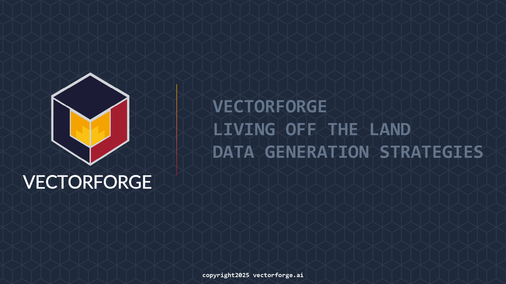

# VectorForge LotL Data Pack

**Three workspace paths for Living‑off‑the‑Land (LotL) telemetry into VectorForge**

- **Option A — Download-only:** Seed with public datasets (Windows + Sysmon).
- **Option B — Generation-only:** Generate LotL in your lab; export Windows/Sysmon/PowerShell/WMI/BITS.
- **Option C — Hybrid:** Seed + generate for fast coverage *and* environment realism.

## Start here
- **How to use internally:** see [internal-usage.md](internal-usage.md)
- Templates: see [/templates](../templates/)
- **Simulate LotL with Caldera:** see [simulate-lotl-caldera.md](simulate-lotl-caldera.md) and [caldera assets](../caldera/)
- Read the [Overview](00-overview.md)
- Pick an option: [A](optionA-download-only.md), [B](optionB-generation-only.md), or [C](optionC-hybrid.md)
- Validate with the [Acceptance Checklist](acceptance-checklist.md)
- See [VF Ingest Schema](vf-schema.md) and [Data Sources](data-sources.md)

---

### Integrity & Licensing
We link to canonical sources (Splunk BOTSv3, LANL UH&N, OTRF Security‑Datasets). CC0 datasets may be mirrored for offline use; we preserve hashes and citations in manifests.